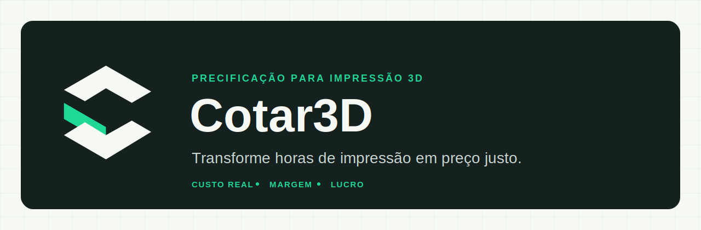
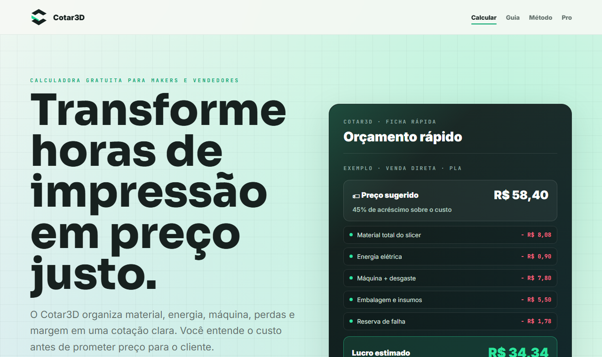

<p align="center">
  
</p>

<p align="center">
  <a href="https://cotar3d.web.app/"><strong>Abrir a calculadora</strong></a>
  &nbsp;·&nbsp;
  <a href="https://cotar3d.web.app/como-calcular-preco-impressao-3d.html">Guia de precificação</a>
</p>

<p align="center">
  Gratuito &nbsp;·&nbsp; Sem login &nbsp;·&nbsp; Cálculo direto no navegador
</p>

## O preço da impressão não termina no filamento

O **Cotar3D** é uma calculadora de precificação criada para makers, vendedores e pequenos negócios de impressão 3D. Ela reúne os custos que costumam ficar espalhados — material, energia, máquina, perdas, mão de obra, insumos, taxas e margem — e transforma tudo em uma cotação clara.

O objetivo é simples: ajudar você a entender o custo antes de prometer um preço ao cliente.

> **Consumo real + operação + acréscimo sobre o custo + taxas = preço sugerido**

<p align="center">
  <a href="https://cotar3d.web.app/">
    
  </a>
</p>

## Uma cotação completa em poucos passos

1. Informe o consumo total mostrado pelo slicer, incluindo peça, suporte, torre, purga e brim ou raft.
2. Escolha o material e indique quanto pagou pelo quilo do filamento.
3. Selecione a impressora ou use um consumo de energia personalizado.
4. Defina o tempo de impressão e o acréscimo desejado sobre o custo.
5. Revise custo real, preço mínimo, preço sugerido, margem real, lucro líquido e lucro por hora.

Os campos avançados permitem incluir mão de obra, desgaste da máquina, embalagem, frete, reserva para falhas e taxas ou impostos quando fizerem parte da sua operação.

## O que o Cotar3D entrega

| Resultado | Por que importa |
| --- | --- |
| **Custo real** | Mostra quanto a peça consome antes do acréscimo comercial. |
| **Preço mínimo** | Indica o limite para não vender abaixo do custo informado. |
| **Preço sugerido** | Aplica o acréscimo sobre o custo e as taxas configuradas à cotação. |
| **Lucro líquido** | Separa faturamento de ganho real. |
| **Lucro por hora** | Ajuda a comparar trabalhos que ocupam tempos diferentes da impressora. |
| **Detalhamento do custo** | Explica para onde vai cada parte do valor calculado. |
| **Orçamento para o cliente** | Mostra quantidade, valor unitário e total sem revelar custos internos. |

## Feito para a rotina de quem imprime

- Utiliza o **consumo total do slicer**, não apenas o peso final da peça.
- Inclui presets de impressoras Bambu Lab e aceita consumo personalizado.
- Possui modo simples para cotações rápidas e campos completos para cenários detalhados.
- Salva padrões somente no navegador, sem conta e sem envio de dados para servidor próprio.
- Funciona em celular e computador, sem instalação obrigatória.
- Pode ser instalado como app leve e continua abrindo sem internet após o primeiro acesso.
- Gera um orçamento limpo para compartilhar, copiar, imprimir ou salvar como PDF.

## Clareza antes de vender

O Cotar3D não escolhe o preço pelo usuário. Ele organiza as variáveis e mostra a lógica da cotação para que cada pessoa possa ajustar acréscimo, mão de obra e custos à própria realidade. A margem real é exibida separadamente para não ser confundida com o percentual acrescentado ao custo.

Os resultados são estimativas baseadas nos valores informados. Custos tributários e obrigações fiscais devem ser confirmados com um contador quando aplicáveis.

## Em evolução

A versão atual é gratuita e não exige cadastro. O produto foi preparado para crescer com recursos como histórico de cotações, peças salvas com fotos, materiais e impressoras personalizados, identidade comercial e uma futura área Pro.

O desenvolvimento está sendo validado com uso real antes da inclusão de recursos pagos.

## Projeto

- **Produto:** [cotar3d.web.app](https://cotar3d.web.app/)
- **Guia:** [Como calcular o preço de uma impressão 3D](https://cotar3d.web.app/como-calcular-preco-impressao-3d.html)
- **Tecnologia:** HTML, CSS e JavaScript, com publicação no Firebase Hosting
- **Testes:** fluxo funcional e visual automatizado em desktop e mobile com Playwright

Para executar os testes localmente:

```bash
npm install
npx playwright install chromium
npm test
```

---

<p align="center">
  <strong>Cotar3D</strong><br>
  Precificação com clareza para impressão 3D.
</p>
